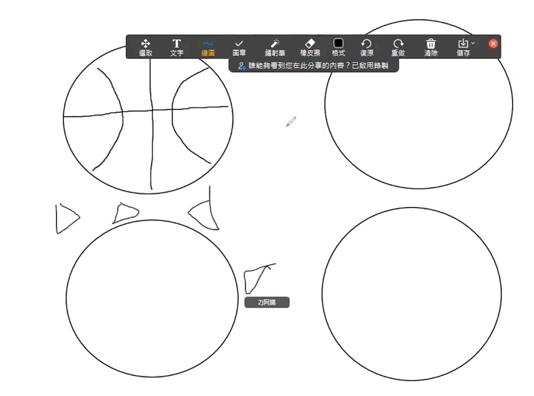

## 一. 道具和时间
A4纸、笔，10 - 20分钟

## 二. 步骤
1. 主持人将家人们分成2个小组，每个小组分笔和纸（人数少的话也可以不分组哦）
2. 每个纸上先有预先画好的基础图案（比如：圆形，三角形，正方形）
3. 在规定时间内，各组家人在基础的图案上加上自己的创意和想法，成为一个有意思的图案
4. 如果在线上的话，需要借助共享屏幕和画画工具哦~

demo: 

## 三. 信息
1. 游戏中的图案可以代表一些在大环境中人不能改变的事，但面对困难我们必须发挥创意祷告去面对，可能有意想不到的结果
2. 「神啊!求赐我宁静，去接受我所不能改变的；求赐我勇气，去改变我所能够改变的；更求赐我智慧，去分辨什么是能够改变的，什么是不能改变的」(尼布尔-宁静祷文)