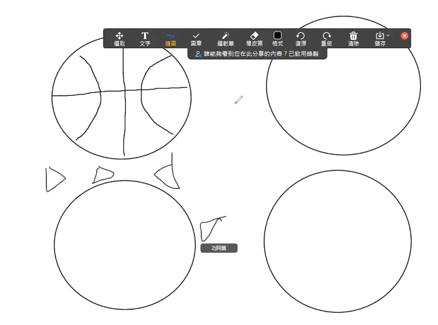
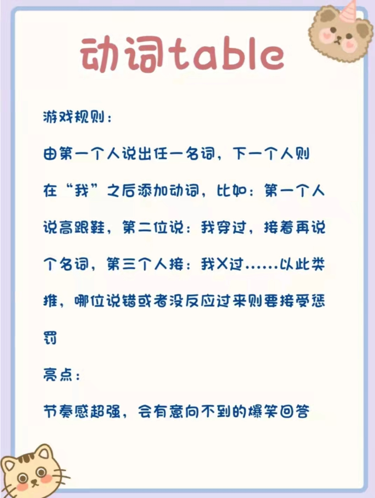
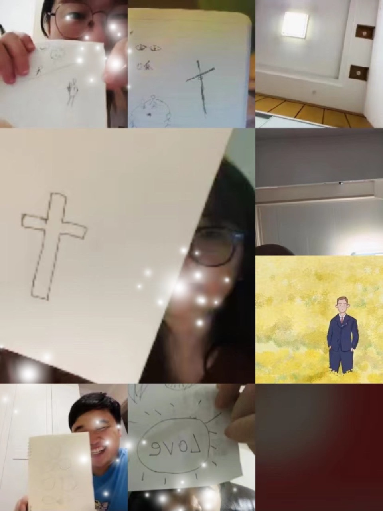
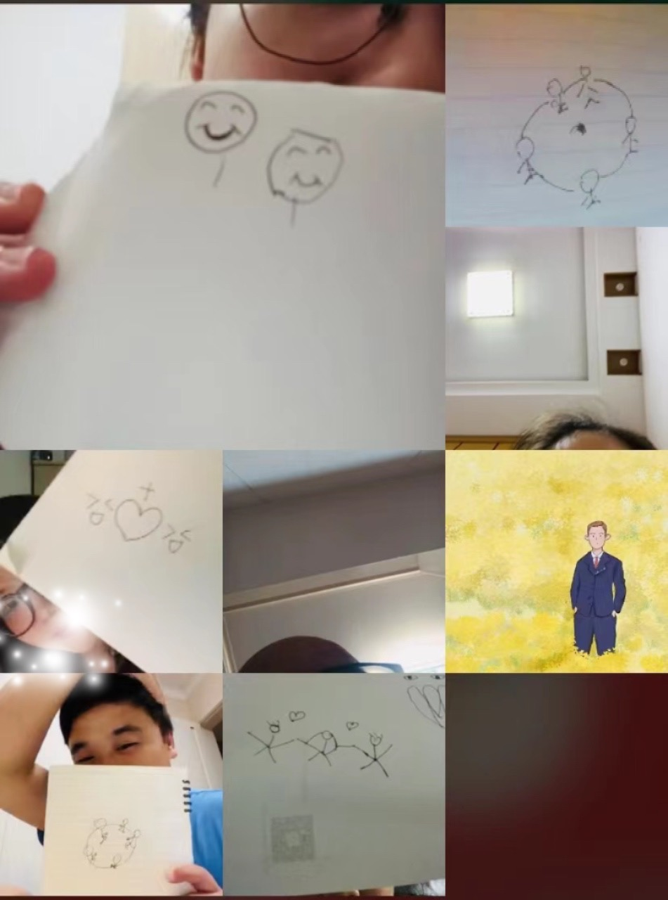

# 句子补全
时间：10-20分钟

步骤：
1. 主持人先准备句子的第一句，如：今天天气真好...
2. 其他家人按顺序，补充具体，前一个人要重复之前人说的
3. 最后补充完整句子即可
4. 看人数，人数多，分组，少的话就一组一起玩。
5. 句子例子🌰： 
   - 当我回到2000年前.... 
   - 尼希米让我们建造城墙.... 
   - 今天我来到教会....
   - 明天是爱博姐生日....

信息：
- 我们一起完成一个句子，就和尼希米让百姓一同建造城墙一样，同心合一，跟随神、敬畏神


# 一个不落下
时间：10-15分钟；雨伞、零食或者小物件

步骤：
1. 将家人们分成2个小组，准备一把雨伞和一些零食或者其他（小物件）
2. 每次安排一位家人撑伞，然后每队将小物件依次放到伞上，保持不掉下去
3. 当有一队放小物件后，小物件掉下去，就扣一分啦
4. 改版：可以先用大伞玩，比较难掉，然后用小伞玩

信息：
- 当我们的根基平稳的时候，就能放下更多的小物件
- 撑伞的就如同耶稣为们的撑伞，担当为们的过犯，为我们的罪死了，我们要记念祂
- 依靠耶和华，一个不撇下（落下）


# 恩典与责任
时间：10-15分钟

步骤：
1. 将纸折成倒“Ｖ”形状
2. 把家人们分为两组 (恩典队与责任队)
3. 每次每组派出一个人来比赛
4. 将V形状的纸条放在桌子上，两人面对面距离60公分以上。纸条放在两人中间
5. 主持人来喊口令，两人同时向纸条吹气，看纸条倒向哪一边，或是被吹到哪一边，那一边的人就输了
6. 每个人都比完后，请每队再派出一人，两人在同一边一起吹这张纸条

信息：
- 当我们生命中的恩典与责任不平衡且在不同边时，我们的生命也会像这张小纸条一样飘来飘去，但如果是在同一边一起吹动，生命就能持续成长前进。

# 土壤的选择
道具和时间：15分钟、有颜色的胶带、硬币

步骤：
1. 用胶带在地上标示出四个距离（可用标靶的图形或斑马线的图形）。
2. 最近的为「路旁」，最远为「石头地」，自设为「荆棘地」，自设为「好土」。
3. 分数：路旁（-10）、石头地（-5）、荆棘地（-1）、好土（+20）。
4. 分为两队，各队拿总数一样的硬币，限时30秒之内轮流丢完硬币。
5. 看哪组加起来的分数较高就是赢家。

信息：
- 撒种的比喻，硬币代表神的道，四种土地代表人的心，我们的心田要作「好土地」，来承接主的道，并结出果子来。

# 物有所长
时间：10 - 15分钟

步骤：
1. 召集所有人集合，不要带任何别的物品（提醒包包之类的物品先放到旁边）
2. 所有人分成两组，从一个起点出发  
3. 只能用身上的物品头尾相连，衣服、鞋子均可；尽可能将所有物品都连接起来，成一条线
4. 在同样的时间内，比两组谁的摆出来的线条最长

信息： 
- 一个团队的获胜需要每一个人出力，带头的作用是很大的，当你发现有人拖鞋的时候，你也愿意拖鞋了。你的一份主动或许也会成为别人的动力哦！
- 每个物品都有它的长度，无论多少，他都可以让自己排上用场。或许你觉得自己的能力有限，但是无论能力有多少，上帝看中你愿意的心。

# 拼音默契
道具和时间：A4纸、柠檬、10-20分钟

步骤：
1. 将家人们分成两人一组，建议可以分为弟兄组、姊妹组、夫妻组相互pk，依次作答题目
2. 用iPad（方便擦掉）或者纸张，上面写上一个拼音，比如苹果的guǒ，第一对小组开始回答
3. 每个小组有5秒钟思考时间，倒计时结束后，要异口同声根据拼音说出心里想到的词语
4. 回答不一样的，责品尝一下主持人提前准备的柠檬一口，酸一下～～～
5. - 技巧：可以提前商量说哪个方面的词语，比如任务，这样会更容易哦～～
   - demo：李磊的lěi、喜乐的lè、善丽的lì

信息：
- 透过这个游戏我们看到默契其实是一种心灵感应，平时是需要培养和操练的，彼此更加熟悉默契。
- 更盼望我们每天亲近神，与神建立默契，神就必亲近我们，好让我们同被一灵所感，异口同声说出神的话来。(雅4:8)

# 圣经拼拼乐
道具和时间：A4纸、10-20分钟

步骤：
1. 视人数多少选择经文长短，家人们可以分成2组
2. 把1张A4纸分n份，每一小份上，写上金句的一个或多个字
3. 打乱一个金句的A4纸，每个小组开始拼接，拼好并优先读出来的小组得一分
4. 升级：可以2或3个金句，混在一起打乱哦～
5. demo：
   - 喜乐的心乃是良药；忧伤的灵使骨枯干。
   - 敬畏耶和华是智慧的开端，认识至圣者就是聪明。

信息：
- 在玩的过程中，每个家人彼此分工，凝聚一起完成金句的拼接
- 人活着不是单靠食物，乃是靠神口里所出的一切话，家人们一起领受祂的话语，操练读经～

# 快乐传真
时间：10-20分钟

内容：
1. 人数多就分2组，每组排好队，前面看不到后面
2. 主持人出题，队列最后一位开始表演，展示给倒数二位看，直到队伍第一个
3. 队伍第一个家人猜一下是什么
4. demo：做家务
   - 抢红包
   - 上厕所
   - 李磊带敬拜
   - 马铃弹钢琴
   - 大卫战胜歌利亚
   - 摩西举手，以色列得胜

信息：
- 游戏中第一个家人表演很重要，后面的家人们也要顺服表演
- 顺服了就蒙福哦～～

# 层层迭
道具和时间：自己的东西，10-15分钟

步骤：
1. 分两组；各取任何属于自己的东西当作砖头；可以是银 包、书包、书本、腰带、波鞋、银纸、卡......
2. 第一轮，自己的东西，叠起来，叠得最高组得一分
3. 第二轮，身边可以用的东西（可以拿的，征求家人同意），叠起来，叠得最高组得一分

信息：
- 基础很重要，要高就一定要打稳基础，**往下扎根**，向上结果。

# 五件事
道具和时间：10-15分钟

步骤：
1. 选择一个主题，每个人有15秒的时间来说五件与主题相关的物品，例:商店(售货员、手推车、收银台、钱、袋子)可以每次换主题，如果想增加难度可以一
2. 直重复在一个主题，别人说过的词语不能再说
3. 如果一个人同时说5件太难的话，可以每个人轮流说1件，说不出来或者卡顿时间太长的就淘汰
4. 主题也可以选择身边的人或者圣经的话相关

信息：
1. 生活中我们常常会对一些比较熟悉的人事物产生联想，比如我们每次聚会都来经常联系的小组家人们
2. 也盼望我们每天多多亲近神，与祂熟悉，当生活中遇见什么事情的时候能够第一时间想到神，联想到祂宝贵的话语，指引我们的方向。(诗119：105)

# 天花乱坠
道具和时间：两把雨伞（适合下雨天玩，因不用特意带雨伞嘛）和一副象棋

步骤：
1. 分两组；每组获发一把雨伞、半副象棋
2. 每组选出一人，把伞子撑开，双手握持伞柄，伞柄不能再触及其它地方以借力。
3. 两组组员将棋子逐个逐个放在伞顶上（主持人留意两把伞的布面滑度是否相近）
4. 限时内（例如一分钟），放得最多的一组获胜
   
信息：
- 一起同心协力就能放的更多


# 别问我是谁
道具：带领者预先用小字条写下全组组员的名字(当天没有出席的也可用)

步骤：
1. 请每位组员抽一张小字条，上面写着一个组员的名字。
2. 当你看到那组员的名字后，便想想他有何特征。例如：口头禅、小动作等，然后你要用三个动作(如需发声也可)来形容那人，让其他组员猜是谁，看看你对其他组员的认识有多少。〈让每人都有机会表演，约15分钟后停止〉

信息：
- 虽然我们每个人都是不同，但当主耶稣拯救我们以后，我们都能一同敬拜同一位的上帝，现在就让我们同声赞美上帝的名。

# 创意画圆圈
道具和时间：A4纸、笔，10 - 20分钟

步骤：
1. 主持人将家人们分成2个小组，每个小组分笔和纸（人数少的话也可以不分组哦）
2. 每个纸上先有预先画好的基础图案（比如：圆形，三角形，正方形）
3. 在规定时间内，各组家人在基础的图案上加上自己的创意和想法，成为一个有意思的图案
4. 如果在线上的话，需要借助共享屏幕和画画工具哦~

demo: 


信息：
1. 游戏中的图案可以代表一些在大环境中人不能改变的事，但面对困难我们必须发挥创意祷告去面对，可能有意想不到的结果
2. 「神啊!求赐我宁静，去接受我所不能改变的；求赐我勇气，去改变我所能够改变的；更求赐我智慧，去分辨什么是能够改变的，什么是不能改变的」(尼布尔-宁静祷文)

# 动词table
道具：带领者预先用小字条写下全组组员的名字(当天没有出席的也可用)

步骤：
<!--  -->
1. 由第一个人说出任一名词，下一个人则在“我”之后添加动词，比如：第一个人说高跟鞋，第二位说：我穿过，接着再说个名词，第三个人接：我X过...
2. 以此类推，哪位说错或者没反应过来则要接受惩
3. 亮点：节奏感超强，会有意向不到的爆笑回答

信息：
- 万物都是神所造的，但是我们却常常忽略这些细节，从而忽略了很多恩典。盼望我们都可以常常怀着感恩的心

# 盲人摸象
道具时间：猜的物品、15 - 30分钟

规则：
1. 主持人准备一个纸箱子，上面开一个口（用手摸），旁边露出一面（方便其他家人看）
2. 主持人准备一些猜的物品，例如苹果、气球、橡皮、领带、万字夹、袜子等等
4. 主持人准备一些没有猜对的爱心行动小纸条
5. 如果人数较多可分组，然后比分机制
6. 如果人少就一个人一个人摸
7. 没有猜对的家人，需要在爱的行动小纸条抽一个去执行。

信息：
1. 当家人们熟悉猜的物品的时候，一摸到就能猜到了，没有猜对的家人也表明呀，我们需要和身边家人更多的彼此熟悉，彼此相爱
2. 我们和神的关系也是一样，当我们和神的关系更亲密的时候，我们就能更深明白神的话语，得到神所赐给我们的福分

# 默契大考验
道具和时间：A4纸、笔，10 - 20分钟

步骤：
1. 首先主持人示范，一个水果，家人们会想到什么呢，把想到水果画出来；
2. 规定时间到了之后，家人们展示所画；
3. 画的是一样的家人们，加一分哦；
4. 题目：
   - 当你们第一眼看一位家人脸部的时候，会哪个脸部部位？
   - 时钟的某一个时点？
   - 李磊的喜欢的水果呢？
   - 动物呢？
   - 天气，家人们会第一个想到什么天气呢？画出来？
   - 想到小组聚会的时候，会想到什么呢？
   - 圣经故事呢？
   - 最后升华一下：想到耶稣，你会画什么？
5. 得分最多的家人们得到彼此的默契大奖励。
6. 想到耶稣，你会画什么？
   
7. 到小组聚会的时候，会想到什么呢？
   

信息：
1. 每个家人们遇到问题的思路都不一样，但是上帝依然爱着我们，因为不一样，我们在主爱里更精彩。
2. 当回忆到小组，聚会的时候，可能有的家人会没有来参加，盼望家人们，彼此关心扶持，祷告代求，一起来到主爱的家中。
3. 升华的问题也是我们所要去行的，家人们一起加油，完成传福音的大使命。

# 默契排序
道具：计时器

步骤：:
1. 组员可以先自由站立，但不能说话。
2. 然后带领者发出指令，则大家依照指令排序站好，速度要快。
3. 带领者可设计不同内容，限时完成。（例如：按年龄从大到小；按身高从高到低；按体重从轻到重；按生日月份从小到大；按鞋码数从大到小……）
4. 排序内容：
```js 
  `眼睛度数
  笑起来牙齿露出来的个数
	脚大小
	皮肤从黑到白  
	头发从短到长
	年龄从大到小
	身高从高到低
	生日月份从小到大
	鞋码数从大到小
	手掌从大到小
	本周读经从0开始排序
	本周灵修从0开始排序`
```

信息：
- 游戏过程中，大家不能用语言交流，可提高彼此默契度，排序过程中自己会找到合适的位置，这就是同工的默契，补足空缺需要组员之间的默契。

# 默契游戏
道具时间：提前准备好若干题目（描述一个人）的小纸条、10-20分钟

规则：
1. 个人默契：首先给家人们排个序，然后依次来随机抽取题目，看到自己的题目后，抽取的人要真实地报出自己心里觉得和题目描述相符的一位牧区家人的名字，看哪位家人和抽取的家人最有默契，最先猜中Ta看到的是什么题目。
- （题目示例：看上去幽默感十足的人、看上去胶原蛋白很多的人、看上去经常熬夜的人、看上去眼睛度数最高的人、看上去追求神话语的人、看上去今天游戏能赢的人…）
2. 集体默契：说出一个词，家人们同时闭眼做一个固定动作，做相同动作的人数必须是事先说好的数字即为挑战成功。（如：游泳、拍照、打羽毛球…）

信息：
1. 透过这个游戏我们看到默契是一种心灵感应，需要培养，那要怎么培养呢？就像我们jh今年的主题：在基督里更深联结，我们越联结就越熟悉，越熟悉就越默契。
2. 盼望我们肢体之间多多联系走动，更要与神建立默契，我们亲近神，神就必亲近我们，好让我们同被一灵所感，听见神的声音，说出神的话来。

# 扑克牌大作战
道具：2副扑克牌

步骤：
1. 将组员分成俩组，每组一副扑克牌。
2. 带领者将俩组的扑克牌打开，反面混乱地摊在桌子上。
  俩组所有人在带领者未发布指令前，不能碰到扑克牌。
3. 第一轮，俩组在最短时间内将扑克牌正面向上，最快的一组获胜。
4. 第二轮，俩组在最短时间内将扑克牌颜色分开，相同颜色放一起，最快的组获胜。
5. 第三轮，俩组将扑克牌按照数字（不考虑颜色）顺序排列好。
6. 第四轮，俩组将扑克牌按照图形花色顺序排列好。
7. 第五轮，俩组将扑克牌按照每个数字4次顺序排列好。
8. 五轮评出最后优胜组。
ps：主要游戏难度需要逐步升级，氛围靠主持人把控住。

信息：
- 提高小组协作能力、行动力和凝聚力，
- 每一个人可分享玩游戏过程中自己的心情和参与度。
- 我相信每个人都积极参与，那么如果小组处在倍增期或行动期，
- 每一个组员如果有这样的热情和参与度，小组就是生命力活泼的小组。

# 送球比賽
道具：小汤匙（可以用星球杯的勺子）、大汤杓、纸杯、A4纸卷成的小球

步骤：:
1. 所有家人分成2组（按人数来定）。
2. 预备一个小球和大汤杓，设定一段距离，计时1分钟，试着用汤杓把兵乓球传到前面，投入杯子中，传送中只要球掉了就换下一位。
3. 预备一个小球和小汤匙，组员发一支汤匙(星球杯的勺子)。设定一段距离，计时1分钟，试着用汤匙把兵乓球传到前面，投入杯子中，传送过程中只要球掉了，就要换下一位，重新再来。
4. 最后分别计算1分钟内，两种方式成功的次数。

信息：
- 小汤匙就像小信心，对神的话不肯定，不容易成功；大汤匙就像大信心，对神的话语有把握，抓住神应许，就能胜过疑惑。最后请大家对左右两边说：加油哦，要对神有信心。

# 听歌猜歌
时间：10 - 20分钟

步骤：
1. 主持人随机播放一首歌曲的某个部分，小组成员聆听并快速举手抢答歌曲的名称或接下一句歌词，最先答对歌名或者下句歌词的成员各得一分，直至游戏结束。
2. 积分最多的成员大家集体夸赞：你真棒！
3. 积分最少的成员则要唱几句自己最喜欢的歌曲给大家听。

信息：
- 了解各小组成员对诗歌的熟悉程度和乐感。激励家人们应当常常以颂赞为祭献给神，这就是那承认主名之人嘴唇的果子。

# 正面朝上 正面朝下
道具：扑克牌、书本、纸杯

步骤：
1. 所有队员分二组

2. 主持人把扑克牌散落在地上，播放音乐
    第一组负责把扑克牌，正面朝上，第二组负责反面朝上

3. 音乐停止，数数正面多还是反面多，玩3局

信息：
- 在这个游戏中，你们中的一半人试图做一件事
- 而另一半人试图做完全相反的事情
- 我们要做正的事情，用心去做
- 这样就可以带领走偏的，软弱的家人们回归正路，加油哦！

# 竹筍竹筍蹦蹦出
人数：6人以上

过程：先看一段影片  [【床编故事】竹笋竹笋蹦蹦出 - YouTube](https://www.youtube.com/watch?v=1Nq0PA1KTQQ)

1. 带领者喊：「竹笋竹笋蹦蹦出！」就要抢着报数。
2. 若有2人以上同时喊同一号码，则喊的人就算输了。
3. 如果从头到尾都顺利喊完，则最后一个喊的人算输了。
4. 如果5秒内都没人接续喊数，则还没喊的人都算输了。
- PS:可以加入节奏开始循环的四拍

# 筑起祭坛
道具：游戏咭(如UNO)及万字夹

步骤：
1. 将全组人平均分成两组或三组。
2. 分发给每小组一盒游游咭(如UNO)及一盒万字夹。
3. 限时10分钟，每组要尽量将材料建成一座建筑物，看看哪一组能建得最高。

信息：
- 当我们在建筑起一个结构的时候，同时提醒我们是如何的建筑起自己的属灵生命、事业、学术成就、家庭或者个人生命的质素，愿神帮助我们在建构起自己的生命祭坛时，能够合乎上帝的心意，让我们一起敬拜那一位为我们「看守城池」的上帝。

# 预防假先知
[预防假先知](../%E9%A2%84%E9%98%B2%E5%81%87%E5%85%88%E7%9F%A5)

# 猜谜语
[猜谜语](../%E7%8C%9C%E8%B0%9C%E8%AF%AD)