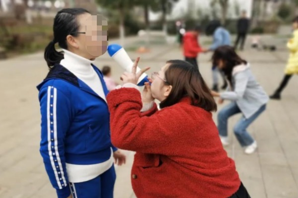

# 因真理得自由

时间：10分钟

步骤：
1. 小组长说明：主耶稣向犹太众人说：”你们必晓得真理，真理必叫你们得以自由。”（约八32）又说：”所以天父的儿子若叫你们自由，你们就真自由了。”（约八36），这种真自由就是摆脱罪恶权势的束缚，靠着主的真理得胜魔鬼。
2. 请大家先背熟上面两节经文。然后全体分成两半，一半站在大圆圈，各人间隔两臂平伸的距离，手牵手站好。这个圈子代表罪恶权势的束缚，另一半的人站在圈子内，要俟机冲出圈外，代表脱离罪权，得享自由。
3. 带领者喊“预备，开始！一二三四五六七八九十。”在一至十之内，圈子内的人要从空隙冲出去，圈子的人则紧牵着手，尽力阻隔。喊”十”之后，没有冲出去的人站近阻挡他的两个人面前，右边那个人要问”约翰福音八章32节？”或”约翰福音八章36节”他必须把圣经背出来。如果背得完全无误，可以走出圈外，因为他”因真理得自由”，要不然就留在圈内。
4. 算算看”得自由”的（已冲出和背圣经后走出的）一共多少位。然后两半互换。看那一边得自由的人数比较多，就算胜利，由他们一起把两节圣经背一遍。
5. 备注：也可以重复作两次，以积分高的算赢。带领者喊声要大，加上千军万马奔腾，场面十分壮观。

信息：
- 可以用作圣经学习的时候，家人们一起玩，加强经文记忆，靠着真理得以自由

# 结圣灵的果子
道具和时间：水果(葡萄，枣子，等较圆的水果)、有水的盘子、汤勺

步骤：
1. 带领者先和弟兄姊妹们背熟圣灵果子的名称。然后分组（根据人数来）
2. 每队要把9种果子轮流结出来。仁爱、喜乐、和平、忍耐、恩慈、良善、信实、温柔、节制。
3. 各队的人站在起跑线上，线上放一个盘子，内装水和水果，一段距离后再放盘子。
4. 第一个人手拿汤勺，开始后，大声说 “我要结出仁爱的果子“，然后用汤勺拿起水果，跑到终点，放到盘子内，再回来交给第二个人，以此类推，全部结完。
5. 看那一对最快，就是胜利队啦～
6. 规定：
    - 若是果子掉了，只能用汤勺弄起来
    - 跑时一只手要放在背后，不可用手护着果子
    - 不够9人一队的也可，只要将果子轮流结果2次即可
    - 接到汤勺未跑前要喊 我要结***果子，可增强比赛紧张气氛。忘记喊，喊错要重来哦

信息： 
- 马太福音第三章说：你们要结出果子来，与悔改的心相称。

# 气球传纸杯
道具和时间：纸杯、气球、时间20 - 40分钟

步骤：
1. 将家人们分成若干小组，按人数来定，可以6-8人一组；
2. 准备气球和纸杯，纸杯底部对贴粘好；
3. 每个队第一位家人吹鼓气球把纸杯托起传递给下一位，下一位家人们需要用吹鼓的气球把纸杯接住（不能用手），继续传递下去；
4. 传递的途中，若掉下，重新来，直到纸杯传递到小组最后一位家人就结束啦。

信息：
1. 刚开始的传递的时候，家人们可能不是很熟练，会一直掉下去，但一直练习的时候，就会熟能生巧，就如我们对神的认识，也是在灵修和祷告中慢慢更深的。
2. 玩的时候有观察到，熟练的家人会指导不熟练的家人们，盼望家人们能在这样爱的大家庭里，彼此扶持，用爱心互相包容，一群人走的更远呀~~
   
# 身份不明
目的：营造轻松气氛，大家在场内走动，让参加者互相认识。

人数：不限，人越多越好玩

步骤:
1. 主持人先设定2-3条题目：
	 - A：我的姓名是...
	 - B：我爱吃的水果是...
	 - C：我最爱的课目是...
2. 参加者在场内自由走动。 
3. 当两位参加者相遇时，大家互相介绍自己给对方认识，并回答对方3条问题。 
4. 然后两位参加者就要记住对方的资料，然后代替对方的身份，遇到下一位参加者时，就用上一次遇到的参加者的资作回答，该身份不停交换下去。 
5. 最后，可邀请大家坐好，访问一下大家现时是什么身份。

意义：
- 上帝造每个人都是不一样的，不一样的姓名，不一样的爱好，但祂都一样的爱着我们

----------------------------------------------------------------

# 是否与此无关（海龟汤面）
目的：锻炼家人们彼此分享，凝聚

人数：不限，人越多越好玩

步骤：
1. 以小组为单位，通过主持人给出的汤面(故事的精简版; word形式或是ppt形式)询问与汤面有关的问题，
2. 主持人只能回答“是”，“否”和“与故事无关”。
3. 通过不断询问问题来还原故事本来的面貌(询问次数不限)。
4. 例子：
   - 汤面一：一对夫妻的第三个孩子出生了，于是他拯救了整个家庭。
   - 汤底：第一个孩子得了白血病，但第二个孩子血型配不上无法移植，所以生了第三个孩子，第三个孩子恰好能够提供造血干细胞来成功匹配医治第一个孩子的白血病，所以拯救了家里的一个小生命就相当于拯救了整个家庭。

	----------------------------------------------------------------

   - 汤面二：一个天才的盲人独臂钢琴师为他的朋友弹奏了一首曲子后，就把他的朋友全都杀死了。这是怎么回事?
   - 汤底：当时钢琴师和他的朋友都被困了，没有食物，所以他们决定每个人都要砍掉自己的一只手臂来吃，别人没有做到，但是盲人因为看不到，所以不知道，他以为他的朋友们只有一只手，但是没有想到后来在他弹奏钢琴的时候，他的朋友们鼓掌了。所以这位盲人独臂钢琴师知道他的朋友们当时没有遵守一起砍手的约定，就把他的朋友们都杀死了。

	----------------------------------------------------------------
   - 汤面三：一个人半夜醒来打了自己一巴掌，然后闻着一股燃烧的味道安心睡去了，请问发生了什么?
   - 汤底：这个人被蚊子叮醒，打了一下没打着。然后点起了蚊香。

	----------------------------------------------------------------
	 - 汤面四：小强养了一只很忠诚的狗，今天他牵着狗上街，然后小强死了。
	 - 汤底：小强这次上街突发心脏病，狗不让其他人靠近主人包括医生。耽误了治疗时间，导致了小强的死亡(真实事件改编)。

	----------------------------------------------------------------
	 - 汤面五：1.11月，男人在外露营，给朋友打了一个电话，接通后没有说话就挂断了，请问这是怎么回事?
	 - 汤底：男子跟朋友露营，住在两个帐篷里，朋友晚上打呼噜太吵了，男子受不了，没法好好睡觉了，所以他给朋友打电话，把朋友吵醒了不会在打呼噜了，所以他就挂掉了。

信息：
1. 神造我们是有灵的活人，区别于动物我们是有思维有理性的，我们的思维理性要按照神的旨意来引导，就能找到正确答案，否则，方向错了，一切都是白费。
2. 那要如何引导呢?神透过圣经主动启示祂自己，我们透过祷告主动寻求神的心意，我们反思自己做事是否是神的旨意，还是与神无关?真的盼望我们都能养成每天读经祷告的蒙恩习惯，明白神的旨意，走在正确的道路上!(参见箴16:9)
   