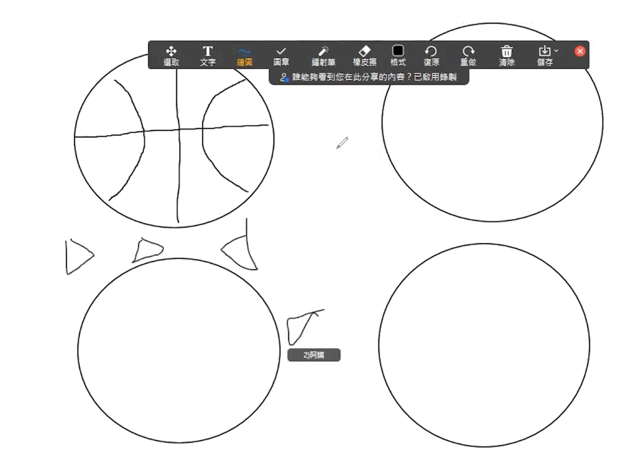

# 加字游戏
道具：脑和口、10-20分钟

步骤：
1. 由一位家人先说出一个字，然后其他家人在这个字的基础上依次添加一个字, 使之能连成通顺的话,加到不能再加为止，再换新词。
2. 例如：饭，吃饭，吃米饭，想吃米饭，想吃大米饭，我想吃大米饭，我就想吃大米饭…
3. 说错的家人来出题继续哦

信息：
1. 在生活中我们可以尽情地发挥我们的想像力去丰富我们的言语表达，锻炼我们思维的开放性和创造性，增加交流的欢乐。
2. 但是对圣经中神的话我们要抱着绝对严肃和敬畏的态度，不可随私意增减解说：“因为所吩咐你们的话，你们不可加添，也不可删减，好叫你们遵守我所吩咐的，就是耶和华你们神的命令。”（申4：2 ）“我向一切听见这书上预言的作见证，若有人在这预言 上加添什么，神必将写在这书上的灾祸加在他身上；这书上的预言，若有人删去什么，神必从这书上所写的生命树和圣城，删去他的份。”(启22：18-19)

# 默契大考验
道具和时间：A4纸、笔，10 - 20分钟

步骤：
1. 首先主持人示范，一个水果，家人们会想到什么呢，把想到水果画出来；
2. 规定时间到了之后，家人们展示所画；
3. 画的是一样的家人们，加一分哦；
4. 题目：
   - 当你们第一眼看一位家人脸部的时候，会哪个脸部部位？
   - 时钟的某一个时点？
   - 李磊的喜欢的水果呢？
   - 动物呢？
   - 天气，家人们会第一个想到什么天气呢？画出来？
   - 想到小组聚会的时候，会想到什么呢？
   - 圣经故事呢？
   - 最后升华一下：想到耶稣，你会画什么？
5. 得分最多的家人们得到彼此的默契大奖励。
6. 想到耶稣，你会画什么？
   
7. 到小组聚会的时候，会想到什么呢？
   

# 答非所问
道具：家人、若干个问题

步骤：
1. 请你方与对方相互提问，回答需与问题毫无关系，且必须在十秒内作答。
2. 例如：A问B:“你今年几岁?B若回答18” 则失败，B若在十秒内回答“苹果”则游戏继续，轮到B向A提问。若一方发生失误或超时，则另一方获胜，记一分，先得到两分的队伍获胜。
3. 问题
   - 你们准备好了吗？
   - 我刚刚说的话你们听清楚了吗？
   - 你早上吃了什么?
   - 今天会冷吗?
   - 最喜欢的明星是谁?
   - 送给自己的一句话
   - 你今天心情怎么样?
   - 你害怕的时候怎么办?
   - 你最想对老师说什么?
   - 你最喜欢吃什么东西?
   - 你刚才打错了吧?
   - 1+1等于几
   
信息：
1. 在生活中如果我们答非所问常常会让人嘲笑；但是圣经中耶和华对于约伯受苦的原因给予的回答是大自然，看似是答非所问，其实是上帝启示祂自己，万事万物背后都有一位造物主的存在。即或有不明白的，但我们仍然可以选择去相信惟有神才是真正的答案。
2. 盼望我们都能够多多地寻求神，祂会回答我们心中的疑问。

# 照片放大镜
道具和时间：
照片，10 - 20分钟

步骤：
1. 主持人先准备一张放大的照片，然后慢慢缩小展示，让其他家人们猜照片是什么
2. 给家人们一分钟时间准备照片，准备好后按顺序展示给其他家人们猜
3. 猜的过程中可以适当给予提示，猜中的家人得到一个呱唧呱唧
4. 照片可以选择：营会祷告，人物，有意义的事件等等....

信息：
1. 每个人都有值得回忆的照片和时光，也有在教会成长的印记
2. 所以盼望我们在神的家里连接更深，也能够更好地彼此相爱

# 猜猜有意义物品
道具和时间：10 - 20分钟，小组家人们对自己有意义物品

步骤：
1. 每个人的身边都有一个对你来说比较重要的私人物品，我们先选定一个物品
2. 然后其他人可以有两分钟时间提问客观型问题(只能回答是与不是。例如：是用电的吗?是我送的吗?之类的)
3. 物品参考：圣经、有纪念意义的笔记本、对自己有意义的属灵书籍等

信息：
 1. 只有我们关系比较近的时候，才会更加了解彼此。所以盼望我们在神的家里连接更深，也能够更好地彼此相爱。

# 创意画圆圈
道具和时间：A4纸、笔，10 - 20分钟

步骤：
1. 主持人将家人们分成2个小组，每个小组分笔和纸（人数少的话也可以不分组哦）
2. 每个纸上先有预先画好的基础图案（比如：圆形，三角形，正方形）
3. 在规定时间内，各组家人在基础的图案上加上自己的创意和想法，成为一个有意思的图案
4. 如果在线上的话，需要借助共享屏幕和画画工具哦~

demo: 

信息：
1. 游戏中的图案可以代表一些在大环境中人不能改变的事，但面对困难我们必须发挥创意祷告去面对，可能有意想不到的结果
2. 「神啊!求赐我宁静，去接受我所不能改变的；求赐我勇气，去改变我所能够改变的；更求赐我智慧，去分辨什么是能够改变的，什么是不能改变的」(尼布尔-宁静祷文)

# 动作接力
道具和时间：10 - 20分钟，小组家人们

步骤：
1. 主持人先在屏幕前做一个擅长的动作，其他家人先来模仿主持人的动作，然后加上自己的动作
2. 家人们按顺序，第一个人做动作，然后第二位，先做第一个人的动作，再做自己准备的动作
3. 如果未完成的家人，惩罚做一个搞怪的动作（比如挖鼻孔）或者自己会做别人做不出来的
4. 改：如果人数过多，最后一个人难度有点大，可以改成后一个只需要做前一个人的动作

信息：
1. 家人们依次做动作，当一起完成一组动作时，就会体验那种凝聚的喜乐
2. 每个人都有自己擅长的动作，就如我们的恩赐一样，恩赐各有不同，彼此扶持搭配
3. 一个人走的快，一群人走的远啊，在主里一起走这属天的道路吧~~~

# 读懂你的嘴唇
道具和时间：10 - 20分钟，小组家人们的嘴唇

步骤：
1. 主持人事先关闭声音，然后嘴巴说话，让家人们猜说的是什么
2. 轮到演示的家人们可以先提示所要说的词语（四个字，男生，旧约人物，亚伯拉罕）
3. 然后静音嘴唇说话（或者只发出唇语，不发声），其他家人们来猜
4. 说话的内容可以是一个词语或者短话（不要超过5个字）
5. 例如：以马内利、耶路撒冷、亚伯拉罕、大卫、恩典、喜乐，等等等...

信息：
1. 家人们可以多多开口，敞开心扉，向我们的神说话，不管是什么方式的声音，祂定会读懂你的声音

# 格价专家
道具：家里的东西，笔，纸（笔和纸也可用口述代替）

步骤：
1. 每位家人可以准备一张纸和笔，先由主持人拿一个物品，其他家人们猜价格是多少（demo）
2. 依次给家人们编号，让家人们准备自家的东西展示，其余家人写下价格
3. 答对等一分，最高分可得到小组家人呱唧呱唧
4. 线下玩时，主持人准备一些零食，其他家人猜价格，价格合适者可以等到该零食

信息：
1. 当我们熟悉家人们展示的食品或者物件时，我们就可以更加容易的猜到对应的价值
2. 我们和神的关系也是一样，当我们和神的关系更亲密的时候，我们就能更深明白神的话语，得到神所赐给我们的福分

# 逛三园
道具：家里的东西

步骤：
1. 主持人安排好发言的顺序
2. 开始者从果园，菜园，动物园三个当中任意选择一个，然后说：xx园里有什么？
3. 例如说果园，接下来按顺序，每个人说一种水果的名字，不能重复。
4. 说不出来的或者停顿比较久的家人会有惩罚哦~~

信息：
1. 问题：神创造植物和动物分别在第几日？（植物：第三日，动物：第五日和第六日，见 创1：11-24）
2. 神创造了花草树木、田野的走兽，海里的鱼，还有空中飞翔的鸟儿，万有都在述说神的荣耀，所以作为神管家的我们人，也更应该要天天颂扬神的伟大作为，好好管理神所托付给我们的一切。感谢赞美主，一切荣耀颂赞都归给祂！

# 口是心非
道具和时间：家人们的手指和头部、10-20分钟

步骤：
1. 请家人们按照事先排好的顺序轮流从1-5这5个数字中，任意说一个数，说的同时要伸出手指来配合，只是伸出的手指不能为该数字。
2. 随机说出头上的某个部位，例如：鼻子、喉咙、眼睛、耳朵、头发、嘴巴、眉毛、牙齿，但是口令和指的部位不要一样。
3. 最后以心口一致的动作收尾。

信息：
1. 当我们口里说出的话和我们心里想的、表现出来的行为（手指动作）不一样时，我们会感觉到很慌张，很别扭；而当我们言行一致的时候会很自然，很平安。
2. 期盼我们都能做诚实人：“你们的话，是，就说是；不是，就说不是；若再多说，就是出于那恶者。”

# 谁最会猜
道具和时间：笔和纸、10-20分钟

步骤：
1. 人多分2组，看哪组得分高，人少不分组，得分高有激励
2. 主持人问问题：家人们抢答
   - 比如： 
   - ①小组某位家人的生日是在几月？
   - ②明天天气大概多少度
   - ③小组家人谁最喜欢喝牛奶🥛？
3. 经常早上会吃到的白色的圆的食物？
4. 小组里谁最爱干净，最能整理收纳？
5. 小组里谁最能说
6. 昨天小组群读经背经几个，灵修几个？
7. 小组里最乐于助人的几位
8. 小组最自律的几位
  - ps： 得分最高的那一个小组或那个人下周小组见面拥有**美味一份**🥰

信息：
1. 我们常常在一起相处，相处越久，越留心观察就越彼此了解也彼此相爱，对于上帝我们也是一样，我们务要认识耶和华，竭力追求认识他。他出现确如晨光；他必临到我们像甘雨，像滋润田地的春雨。 (何西阿书 6:3 和合本)
2. 在我们还活着的每一天，有限的年日要竭力去认识祂的荣耀去爱祂。
   
# 听声音
道具：家里可以发声音的东西

步骤：
1. 主持人会拿出家里的东西敲击声音，让家人猜（demo)；
2. 为每个上线家人编号，依次展示；
3. 其他家人开始举手猜测，猜中得一分；
4. 最终得分最高者，家人们给他呱唧呱唧。

信息：
1. 在猜测的过程中，如果家人们很熟悉这个物体发出来的声音，就会很容易猜到。
2. 轻轻听我要轻轻听, 我要侧耳听主声音

# 头顶画画
道具和时间：纸张、笔、10 - 20分钟

步骤：
1. 主持人会事先自己拿一张白纸和笔，然后把纸垫在头上，用笔绘制图画
2. demo完成后主持人开始出题目，其他家人把纸垫在头上按着题目画
3. 画好一个题目后，家人们一起展示出来，一起来评测谁画的不错，加一分
4. 可以先从形状出发，然后到苹果，西瓜等水果啦，总之就是先弄一下生活中常见的，最后2个可以画房子和十字架，正好代表教会和耶稣，达到了游戏的升华

信息：
1. 在画画的过程，每个人都有各自的风格，正如我们的恩赐有时候也各有不同，家人们，让我们一起在教会中发挥各自的恩赐，去谱写新的篇章
2. 当然啦，在主持人出题的时候，类比神对我们的一些要求和期待，我们要用心听，用心绘制，荣耀我们的神

# 线上对对碰
道具：每位家人

步骤：
1. 主持人说出一个指令，例如，手指对手指
2. 小组家人们需要与萤幕显示左或右边的参加者手指点手指
3. 主持人可循序渐进提升难度及趣味性，例如脚掌对脚掌，或是同时与左右两边参加者进行

信息：
1. 虽然疫情让我们在上线聚会，但是屏幕前的家人们仍然可以手拉手，心连心，一起走
2. 在主里一起加油，更深连结

# 线上谁是丑小鸭
道具和时间：10 - 20分钟

步骤：
1. 主持人首先自己示范，所有家人们关闭摄像头，自己用自己觉得别人听不懂的口音说 **”我是丑小鸭“**，其他家人猜是谁发出的声音
2. 主持人随机私聊点名要说的家人，所有家人们关摄像头，那位家人说1到2次 **”我是丑小鸭“**
3. 其他家人们猜是谁发出的声音

信息：
1. 当小组家人们都很熟悉彼此的时候，就会更容易猜到是谁
2. 就如我们的神，对我们更加的熟悉明了，所有我们不管是发的声音，还是其他的声音，他都了解知道，因为祂是如此的爱着我们
3. 盼望家人们一起在神的家里，彼此关心，彼此扶持，常常喜乐，凝聚在一起

# 边角物
道具：家里的东西

步骤：
1. 主持人会出示一张只显示物件其中一点点，让家人猜（demo)；
2. 为每个上线家人编号，依次展示；
3. 其他家人开始举手猜测，猜中得一分；
4. 最终得分最高者，家人们给他呱唧呱唧。

信息：
1. 在猜测的过程中，如果家人们很熟悉这个物体，就会很容易猜到。
2. 这就和我们和神的关系一样，如果我们和神的关系很亲密，神所指引的路，我们就能感受到。
3. 一起在主里加油哦~